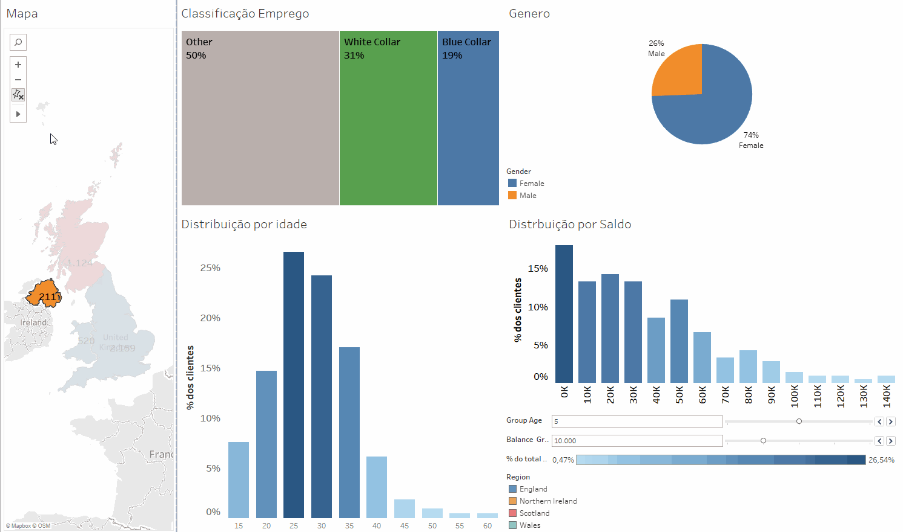
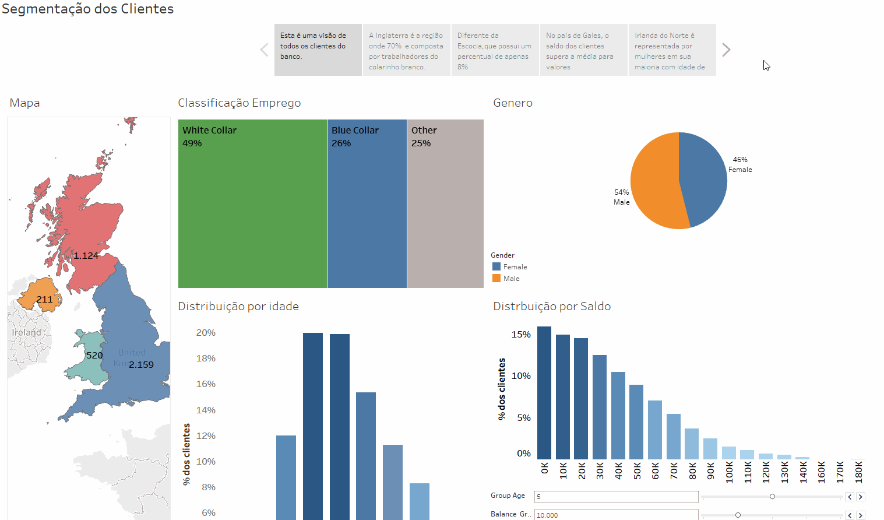

# Bank United Kingdom
---
#### Análise de perfil dos clientes de um banco fictício do Reino Unido, com segmentação dos clientes por renda, gênero, país, tipo de profissão e idade. Um dashboard interativo que destaca as principais características dos clientes de cada país do Reino Unido, acompanhado de uma storytelling dos dados apresentados. 

- Dashboard interativo com filtros ativos para uma melhor segmentaçao dos clientes.

---

- Storytelling dos dados apresentados, destacando elementos para apresentaçoes de analise dos clientes

---

