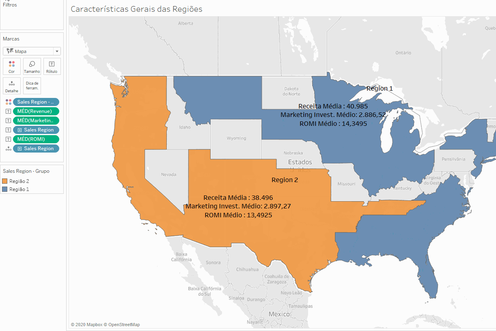

# Startup Expansion

----

#### Caracterizações gerais das regiões as quais as lojas startup estão distribuídas, Clusterização das lojas e análise de tendência das lojas por cluster, possibilitando analisar qual dos clusters são capazes de trazer maior retorno por dolar investido em marketing.

---

